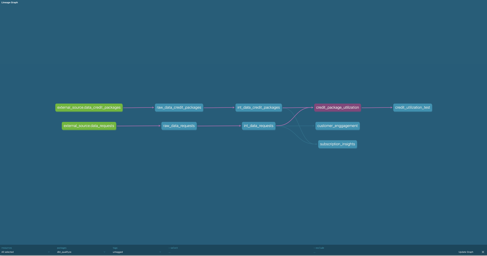

# qualifyze_casestudy

Welcome :
I have worked on this case study challenge and even enjoyed solving the buisness model , i will walk you through the dbt project set and explain the models as well as how to run the project.

Addon : i have used DuckDB database for this project for simplicity and you can find the persisten db file named ####case_study.duckdb

Step 1: install dbt with duckdb (you can create an dbt env: recommended )

### Setup / Stack

Please use:

- **Python** 3.9 or higher.
- **dbt-core** 1.5.x or higher
- **duckdb** 0.9.x

You could install only this package: "dbt-duckdb"
, which will install: dbt-core, duckdb,

once you have installed clone the repo

- git clone https://github.com/vidyuthmk/qualifyze_casestudy.git

cd qualifyze_casestudy/dbt_qualifyze

to check everything in place run

- dbt debug --profiles-dir=$PROFILES_PATH

PS: PROFILES_PATH : provide the path to profiles.yml

Step 2: Project Layout :

This project have 3 layers :

- **Raw** : the raw layer consist of 2 tables that are fecth from extenal csv files, these models are initial stagging models and containes not transformation

  - raw_data_requests
  - raw_data_credit_packages
  - source.yml : this file holds the yml settings for the source file(external files )
  - schema.yml : setting for models

- **Intermediate** : this layer containe 2 models that refers to raw layer models and transfomations such as renaming typecasting and clean ups are performed

  - int_data_requests
  - int_data_credit_packages
  - schema.yml holds the meta data and settings for models

- **Mart** : this layer contains models that are processed and ready to consume by the stakeholer as her in this project contains answers to business quesion models
  - customer_enggagement : This dbt model first identifies customers as either using the transactional model or having a credit package. It then filters those who have transitioned in the last year based on the date of their last request.
  - subscription_insights : This dbt model joins the int_data_requests and int_data_credit_packages tables based on the organization identifier and date ranges. It then provides insights into different subscription types' associations with customer profiles and audit request behaviors, including the average number of credits per request, average value, earliest and latest audit confirmation dates, and the count of completed audits.
  - credit_package_utilization : This dbt model calculates the remaining credits based on the expiration dates, categorizes each credit package as active(1) or expired(0), and provides statistics on credit utilization.

All the columns in the buinsess model of marts are well documents the schema.yml files to deploy and see the lineage

- run : $ dbt docs generate --profiles-dir=$PROFILES_PATH
  $ dbt docs serve

There are & test in total 6 of them are inbuilt
unique_key : this tests the unique row qualifies for the model implimented in raw models and int model can be found in their respective schema.yml files
not_null: constraint for unique id column should not be null

custom test for credit utilization model can be found in generic test folder
"credit_utilization_test.sql" :- Test for data completeness: Total credits utilized should not exceed total credits allocated

